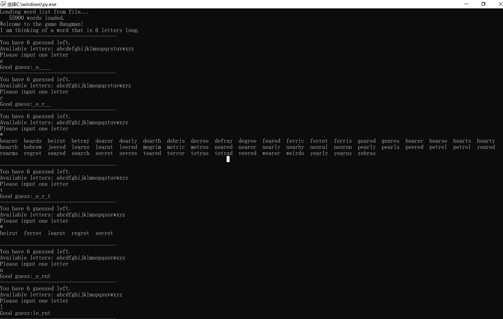
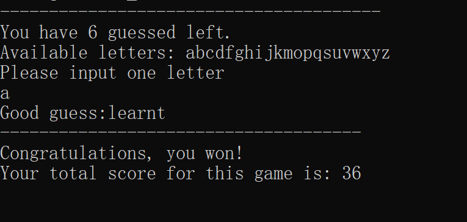

# Assignment 2 report

17340027 姚洁倩

## 问题描述
此次作业要实现的是一个名为hangman的猜单词游戏，电脑在词库中随机选中一个单词，玩家需要猜出这个单词。玩家一共有6次猜的机会，猜错则减少一次/两次。有3次警告的机会。在不耗尽猜测机会以及不超过警告次数的情况下，玩家若猜中这个单词，则游戏胜利。反之，则失败。玩家每次猜测之前，程序需要列出可以猜测的字母列表，在玩家猜测后，需要告诉玩家猜测的结果以及将单词所有被猜中的部分展示出来。在玩家输入不合法的时候或输入已经猜过的字母时需要给出警告
Problem1 要我们实现一个基础的hangman，实现和玩家的交互功能
Problem2 给出了一些帮助函数，让我们实现这些函数，并且通过这些函数的帮助来更好地实现这个游戏。
Problem3 要我们实现一个带有给玩家的提示的hangman，在玩家使用提示的时候，列出词库中所有匹配的单词。

## 解题思路
### Problem 1
在hangmam_p1.py中实现了一个最简单的hangman游戏，程序随机选词，玩家在有限的次数下猜词，猜对的部分会展示出来，猜错则扣除一次机会。
使用了while循环和一个bool变量correct作判断，看玩家是否已经猜中整个单词。若还未猜中，则继续游戏，若猜中，则显示胜利信息并退出。若在机会耗尽之后还未猜中，则显示失败信息。

### Problem 2
实现3个helper function并且完善hangman游戏。
- is_word_guess()此函数判断这个单词是否被猜中，传入的参数是secret_word和letters_guessed，如果secret_word中的每一个字母都在letters_guessed里面，说明被猜中了，使用for循环来进行这个判断。
- get_guessed_word()此函数是用于显示迄今为止被猜对的部分，同样也是使用循环，判断secret_word中的每一个字母是否在letters_guessed里面，若在，则显示字母，否则显示一条下划线。
- get_available_letter()此函数用于获取可猜测的字母列表，凡是之前有被猜过的字母，无论对错，都不在这个列表中显示。二十六个字母循环一遍判断一下即可。

### Problem 3
- hangman()此函数是主函数体。
- 有guess_time和warnings两个局部变量，用以记录玩家剩余猜测机会和警告机会。
- unique变量用于记录单词里有多少个不同字母，用以计算分数。
- 还设置了一个存有元音的list，在玩家猜词的猜错的时候判断一下是否元音，元音扣除两次机会。
- 接下来是循环体进入游戏，输出提示语和字母列表(get_available_letters)。进入循环的条件是还有猜测次数且不在警告次数为0的条件下犯错（即警告次数降到-1）。首先判断玩家输入是否需要触发警告，再次判断玩家是否猜对了，显示出迄今为止猜对的部分（使用get_guessed_word()函数），最后调用is_word_guessed()函数判断这个单词是否有整个猜中，若猜中，则输出胜利信息和分数并退出游戏，否则游戏继续。玩家若用完机会还没猜中，就会跳到循环体外部，这时候会输出失败的信息并且展示出完整的单词。

### Problem 4
实现带有提示功能的hangman游戏。
- match_with_gaps()此函数的功能是查看一个带有下划线的单词和一个特定单词是否匹配
- show_possible_matched()此函数的功能是打印出所有的匹配迄今为止猜出部分的单词。通过循环遍历wordlist里面的单词，对每一个都调用match_with_gaps函数，看看是否和现在猜中的部分匹配，若匹配，则输出
- hangman_with_hints()此函数大体上的Problem3的hangman函数相同，只不过多了判断用户输入是否提示的部分，若用户需要提示，那么就调用show_possible_match给出提示。

## 运行截图

## 一些思考
- 循环条件的判断，开始是进入hangman函数的while循环条件是guess_time != 0 && warnings != -1,这个条件是有问题的，因为guess_time并不是每次减一，而是有可能减二，在它小于0的时候就进入死循环了，所以后面改为了 guess_time > 0。但是warnings是每次减一，所以不影响。