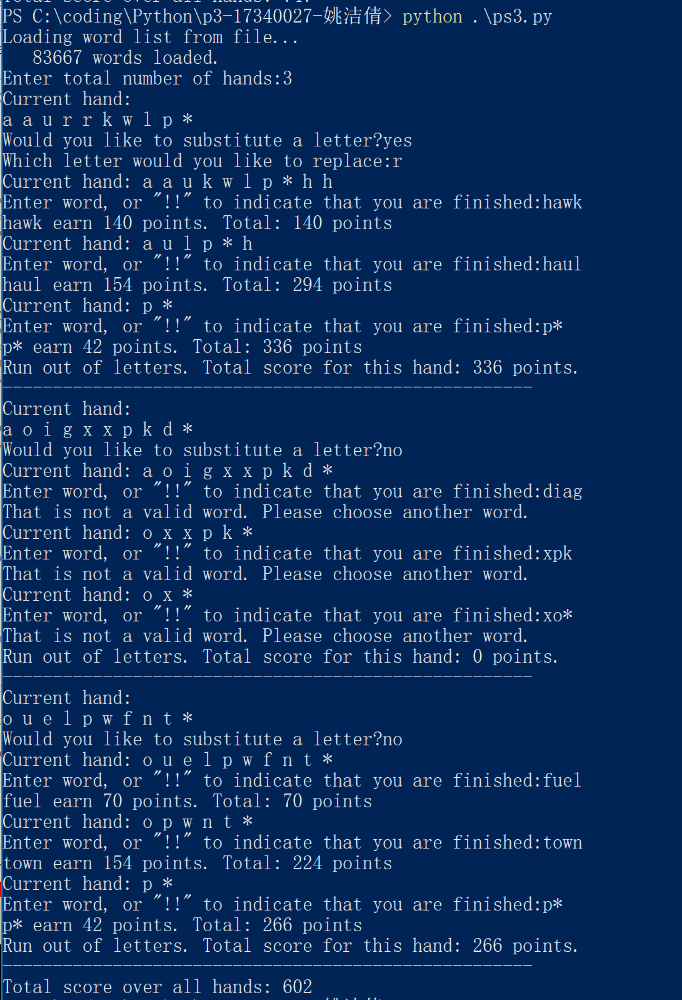
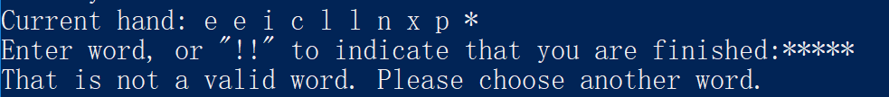

# Assignment 3 report
17340027 姚洁倩

## 问题描述
这个assignment要求我们实现一个word game。玩家手上拥有若干字母组合，要利用这些字母组合成为一个单词，获得积分。我们所要做的便是实现一个这样的游戏。

## 解题思路
首先，按照文档中的提示一步步来。
1.实现函数get_word_score(word,n):此函数计算word可以得到的积分。按照文档中所给的公式进行计算即可。最后只用进行一个比较，若算得的积分小于1，那么将积分置为1，否则，就是计算所得的分值。
2.理解函数get_frequency_dict()：将字符串转化为字典，映射关系是字母及其频率,display_hand()：将hand展示出来,deal_hand()：随机生成一个hand,实现函数update_hand()：将玩家所用过的字母从hand中移除，遍历word中的每一个字母，每一次将hand中相对应的频率减一。减到0的时候将它从hand中移除。
3.实现函数valid_word()：判断一个单词是否合法。将输入的单词转化为dict，一项项对比相对应的字母在word中以及在hand中的频率，若出现大于的情况，就为False。这是判断的第一步，看看输入的单词是否能由hand组成。接下来判断它是否在列表中。先判断不带星号的情况。接下来判断带有星号的情况，将星号的位置替换为元音，一个个判断是否在wordlist里面。
4.实现函数play_hand()使用一个hand来进行游戏，按照伪代码所给的提示一步步进行。使用一个变量total_score来存储分值，使用display_hand()函数来展示目前hand中的内容，接下来收取用户输入，检查是否合法的单词，若合法，则对应加分，并将得分情况打印出来给用户。然后将用户用过的字母从hand中移除，使用update_hand()函数。直到用户主动结束游戏或者hand中没有字母了结束游戏。函数返回total_score值。
5.实现函数substitute_hand()，将hand中的一个字母替换为hand中不存在的另一个字母，使用随机选取字母。这里用元音替换元音，辅音替换辅音。
6.实现play_game()函数。此函数先读入hand的总个数，接着进入循环，循环hand的个数次。在循环体内先问用户是否要替换掉一个字母，接着调用单独的play_hand()函数，来实现这个hand的游戏。最后游戏结束时，输出总分值。

## 运行截图

## 一些极端测例
- 输入为空

- 输入为全部的星号

## 遇到的困难及解决方案
- 在实现is_valid_word（）函数的时候，一开始没有将字符串转化为字典的意识，直接就迭代word里面的每一个字母，然后再在hand中看有没有这个并更新hand的值。后来发现要求hand的值不能修改，便将word也转化为字典，对应字母和它们的频率，一个个与hand中的比较。
- 另外在加入了wildcard之后的此函数，开始时没弄明白这个要怎么判断，后面使用的方法是对word原本为星号的为止进行替换，一个个元音试，看它是否在wordlist里面